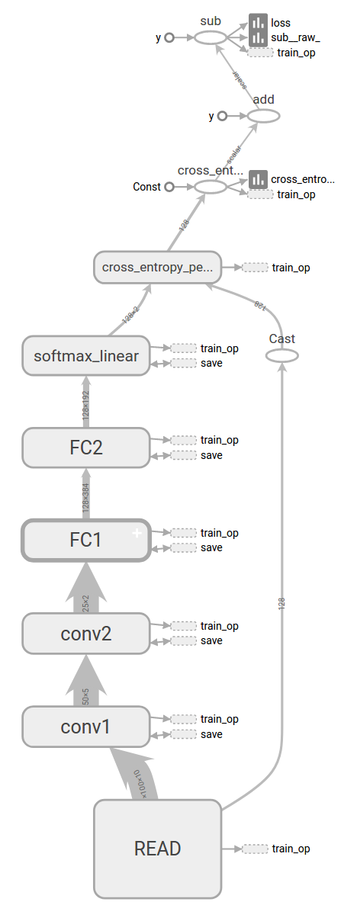
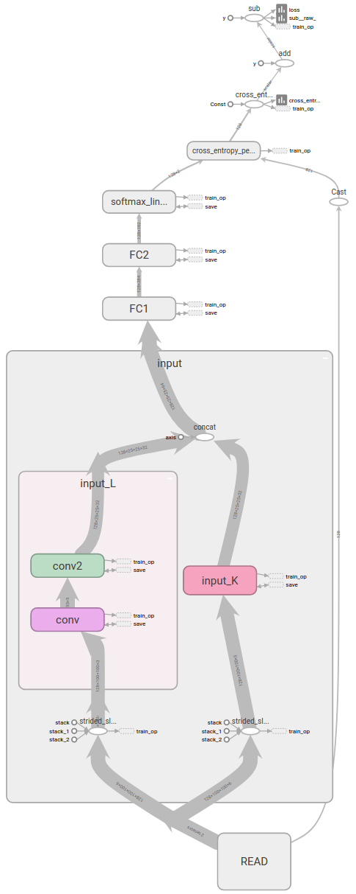
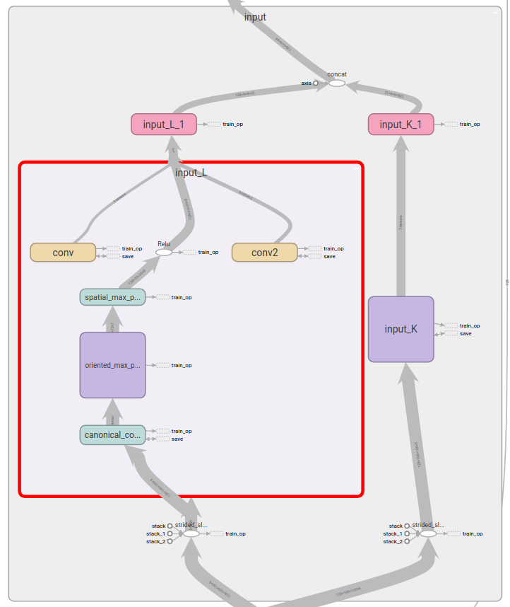
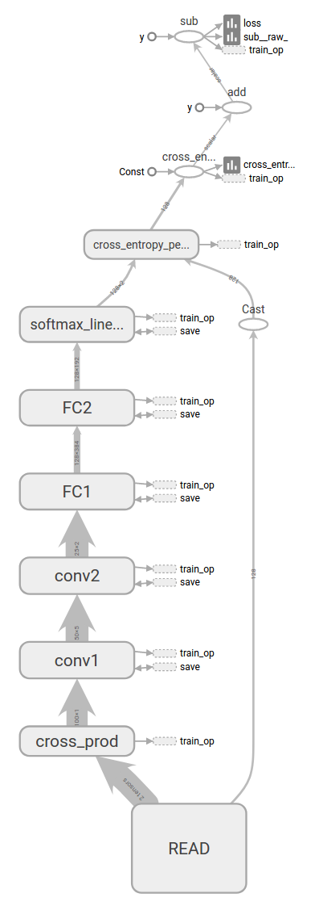

# Shape Matching

## Introduction

​	Here, we are trying to solve the problem of shape-matching. We are given two pieces of a shape; for instance, two halves of a cut triangle. However, we do not know whether these two pieces join together or not. We use a convolutional neural network together with incremental weight-loading in order to accurately predict whether to halves of a shape match each other, regardless of initial position and rotation.

## Architectures & Performance

### Version 0 CIFAR-10

​	CIFAR-10 is a famous image classification dataset, and TensorFlow Tutorial gives an implement of the network. The code is basically copied from [here](https://github.com/tensorflow/models/tree/master/tutorials/image/cifar10).

​	The network has two convolutional layers, both have depth as 64. Then there are two fully connected layers. 

​	The precision of this network is around **94.4%**, which is the worst.

### Version 1 Process inputs respectively

​	In this structure, the two input images are extracted features respectively, and then join into two full connection layers. The reason is that, there's no strong spatial connection between two images (they have their own translation and rotation), so it's not necessary and inappropriate to overlay them together as a 6-channel input. Features should be extracted respectively and then analyzed and classified by full connection layers instead of convolutional layer. 

​	Different convolutional layer depth are tested. Here is the results.

| depth           | 16    | 32    | 64    |
| --------------- | ----- | ----- | ----- |
| without dropout | 97.4% | 97.7% | 96.7% |
| with dropout    | 97.1% | 97.6% | 97.5% |

### Version 2 Process inputs with rotation invariance respectively

​	Add the rotation invariant architecture into the network to process the rotation of inputs. The paper I refer to is [Learning rotation invariant convolutional filters for texture classification](https://arxiv.org/pdf/1604.06720.pdf). 

​	This structure is not tested, because the the training speed is slow and I think the performance is hardly good. But it's quite a good thinking. Instead of using distorted(rotated) input to help the network get used to the rotation of inputs, we can let the network structure itself learn the distortion as well.

### Version 3 Cross product input images

​	It's a thinking of how to let the two inputs relate to each other - by cross production. However, this network won't converge in practice.

## Reference

[Learning rotation invariant convolutional filters for texture classification](https://arxiv.org/pdf/1604.06720.pdf)